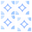

# Yet Another TileSet Editor

## Introduction

Yet Another TileSet Editor (YATE) is an open-source project for creating tileset images from standalone tiles and from existing tilesets.

*Key features*:
- Scriptable tileset generation (easy to integrate into your CICD)
- Reproducable output (there is no auto tile arrangement, the user can define where to put the tiles)
- Version control support (multiple team members can work on the same project to have a common tileset for your entire game)
- [Tiled](https://www.mapeditor.org/) compatibility (the generated tileset can be used for TileMap creation in Tiled)
- Handy and easy-to-use object definitation (define slices and group of tiles within an existing tileset in order to always move the related tiles together)

*Main components*:
- **YATE Project files** (*.yate.json): standard json document which refers all the source tiles and tilesets, and describes all the details for generating a new tileset image
- **Yet Another TileSet Editor**: cross platform desktop application for managing YATE Project files (*.yate.json)
- **YATE CLI**: Command line interface which loads the YATE Project file and generates the output using [ImageMagick](https://imagemagick.org/) commands.

## Overview

## Documentation

[Documentation](documentation.md)

## Links
- [OpenGameArt.org](https://opengameart.org/)
