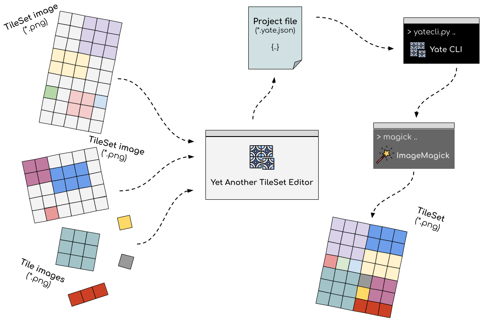
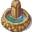
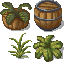

#  Yet Another TileSet Editor

## Introduction

Yet Another TileSet Editor (YATE) is an open-source project for creating tileset images from standalone tiles and from existing tilesets.

*Key features*:
- **Scriptable tileset generation** (easy to integrate into your CICD)
- **Reproducible output** (there is no auto tile arrangement, the user can define where to put the tiles)
- **Version control support** (multiple team members can work on the same project to have a common tileset for your entire game)
- **[Tiled](https://www.mapeditor.org/) compatibility** (the generated tileset can be used for TileMap creation in Tiled)
- **Handy and easy-to-use object definition** (define slices and group of tiles within an existing tileset in order to always move the related tiles together)
- **Trustfulness** (each real image manipulation, including cropping, splitting and montage are performed via [ImageMagick](https://imagemagick.org/) commands)

*Main components*:
- **YATE Project files** (*.yate.json): standard json document which refers all the source tiles and tilesets, and describes all the details for generating a new tileset image
- **Yet Another TileSet Editor**: cross platform desktop application for managing YATE Project files (*.yate.json)
- **YATE CLI**: Command line interface which loads the YATE Project file and generates the output using [ImageMagick](https://imagemagick.org/) commands.

## Overview



| Name | Description | Example |
| --- | --- | --- |
| **Tile** | The smallest building block of a **TileSet**. Its typical size is 16x16 or 32x32 pixels. |  |
| **Tile image** | A separate shape or building block that must always be treated as a whole during editing. Its smallest size equals to the size of the **Tile** (e.g. 32x32), but it could be multiples of that (e.g. 32x64 or 128x96). |  |
| **TileSet image** | An image file containing a collection of smaller, reusable graphic elements, or "tiles," that are used to construct larger scenes in games or maps, such as platforms, terrain, or scenery. |  |
| **TileSet's Slice** | A designated contiguous area within a **TileSet image**. This area can only be moved as a whole, similar to a **Tile image**. |  |
| **TileSet's Group** | A group of several **Tiles** that are far apart within a **TileSet image**, and must then be treated together, similar to a **Tile image**. |   |
| **TileGroup** | A group of **Tile images** that belong together based on some property for easier handling. | - |

### YATE Project

A YATE Project is a standard JSON document, which describes all the required steps to generate the output tileset from the input sources.

Input sources can be the followings:
- Any number of TileSet images
- Any number of Tile images which are grouped into any number of TileGroups

Typical use case, that a game has it's own tile images, grouped into several categories (terrain, building, characters, etc.). In YATE simply define any number of TileGroups and put all the related images into these logical buckets.

Another use-case, that a game is using one or more open-source TileSet images (e.g. from [OpenGameArt.org](https://opengameart.org/)), and the developers want to reuse those, but not in the original arrangement (they don't need all the tiles or they don't want to use multiple tileset images runtime).

The two use-case can be mixed together.

The ultimate goal at the end of the editing process to create a new TileSet image. This output or target TileSet can be composed of the following building blocks:
- A Tile image selected from any of the input TileGroups
- An individual Tile selected from any of the input TileSet image
- A pre-defined Slice (set of connected tiles) selected from any of the input TileSet image
- A pre-defined Group (set of related tiles) selected from any of the input TileSet image

In YATE there is no auto-arrangement of tiles. The user must define the coordinates (using drag&drop and similar handy options) for all the building blocks. This is quite important in a project, where the coordinates are hard coded, or the tileset will be used in [Tiled](https://www.mapeditor.org/) (or similar tool) to build a TileMap. The team can extend the used tileset image, or improve the graphics of any of the tiles, without the risk of breaking the existing TileMaps. 

## Technology

- [JavaScript Object Notation](https://www.json.org/json-en.html) (JSON): The YATE Project file is open to further modifications or extensions
- [Flutter](https://flutter.dev/): Yet Another TileSet Editor program is written in [Dart](https://dart.dev/), using Google's Flutter cross-platform framework.
- [Python](https://www.python.org/): YATE CLI is written in python, open for customization and provides seamless integration with a CICD flow
- [ImageMagick](https://imagemagick.org/): image manipulation is based on the widely used software suite

All used and integrated software components are **open-source** and **cross-platform**.

## Installation

Make sure that all the tools which are listed in [Prerequisites](#prerequisites) are available in your environment. After that just go to the release page and download the YATE binary of your OS. 

Currently Yet Another TileSet Editor supports the following systems:
- Windows 7/10/11
- MacOS Intel (x86_64)
- MacOS Silicon (ARM64)

<a id="prerequisites"></a>
### Prerequisites

If you are using Windows OS, please install [Microsoft Visual C++ Redistributable](https://learn.microsoft.com/en-us/cpp/windows/latest-supported-vc-redist?view=msvc-170), as it requires for the desktop editor.

Yet Another TileSet Editor CLI is written in [Python](https://www.python.org/), so prior to use it you must install it from [here](https://www.python.org/downloads/). Do not forget to put it into your path.

**Windows**:
```
> py --version
Python 3.13.3
```

**MacOS**:
```
> python --version
Python 3.13.5
```

Yet Another TileSet Editor CLI is using [ImageMagick](https://imagemagick.org/) commands under the hood, so you must make it available for this script. You should find binaries for various OS [here](https://imagemagick.org/script/download.php). Do not forget to put it into your path.

**Windows**:
```
> magick --version
Version: ImageMagick 7.1.1-47 Q16-HDRI x64 82572af:20250329 https://imagemagick.org
Copyright: (C) 1999 ImageMagick Studio LLC
License: https://imagemagick.org/script/license.php
Features: Channel-masks(64-bit) Cipher DPC HDRI Modules OpenCL OpenMP(2.0)
Delegates (built-in): bzlib cairo flif freetype gslib heic jng jp2 jpeg jxl lcms lqr lzma openexr pangocairo png ps raqm raw rsvg tiff webp xml zip zlib
Compiler: Visual Studio 2022 (194334808)
```
**MacOS**:
```
% magick --version
Version: ImageMagick 7.1.2-3 Q16-HDRI aarch64 23340 https://imagemagick.org
Copyright: (C) 1999 ImageMagick Studio LLC
License: https://imagemagick.org/script/license.php
Features: Cipher DPC HDRI Modules OpenMP 
Delegates (built-in): bzlib fontconfig freetype heic jng jp2 jpeg jxl lcms lqr ltdl lzma openexr png raw tiff webp xml zlib zstd
Compiler: clang (17.0.0)
```

## Documentation

[Documentation](documentation.md)

## Support

Yet Another TileSet Editor is free and open-source for anybody.
You can use and extend it for your own indie game idea.

**Web**: [https://yate.qwaevisz.com](https://yate.qwaevisz.com)

**E-mail**: <yate@qwaevisz.hu>

If you like it, consider to buy me a coffee.

[](https://buymeacoffee.com/qwaevisz)

## Links
- [JavaScript Object Notation](https://www.json.org/json-en.html)
- [Flutter](https://flutter.dev/)
- [Python](https://www.python.org/)
- [ImageMagick](https://imagemagick.org/)
- [Tiled](https://www.mapeditor.org/)
- [OpenGameArt.org](https://opengameart.org/)
